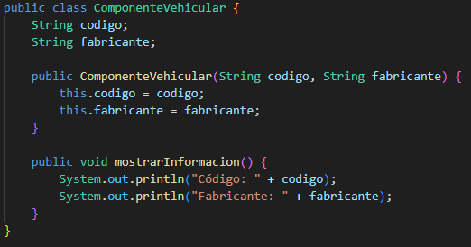
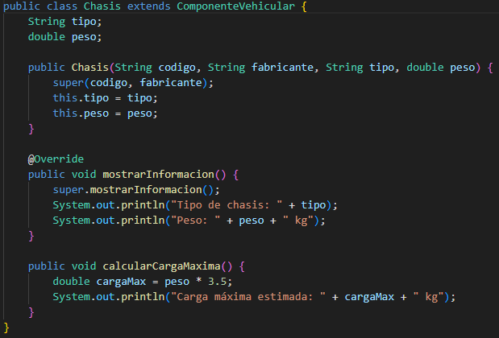
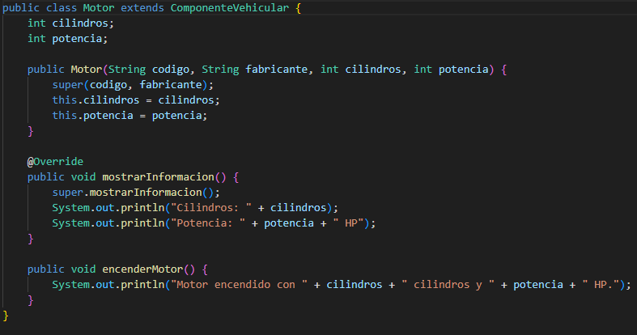
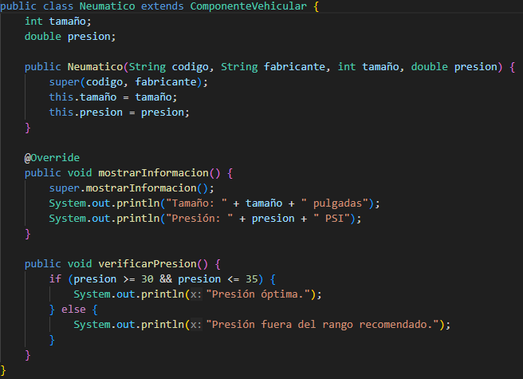
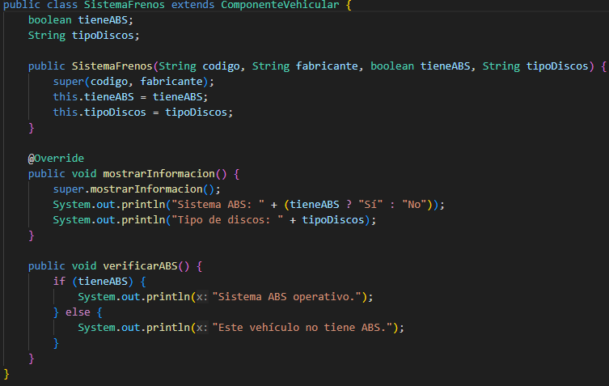
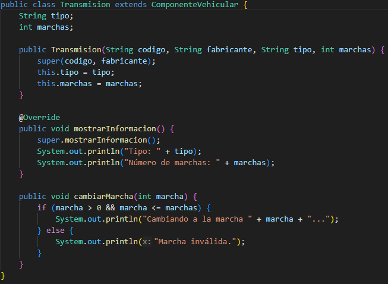
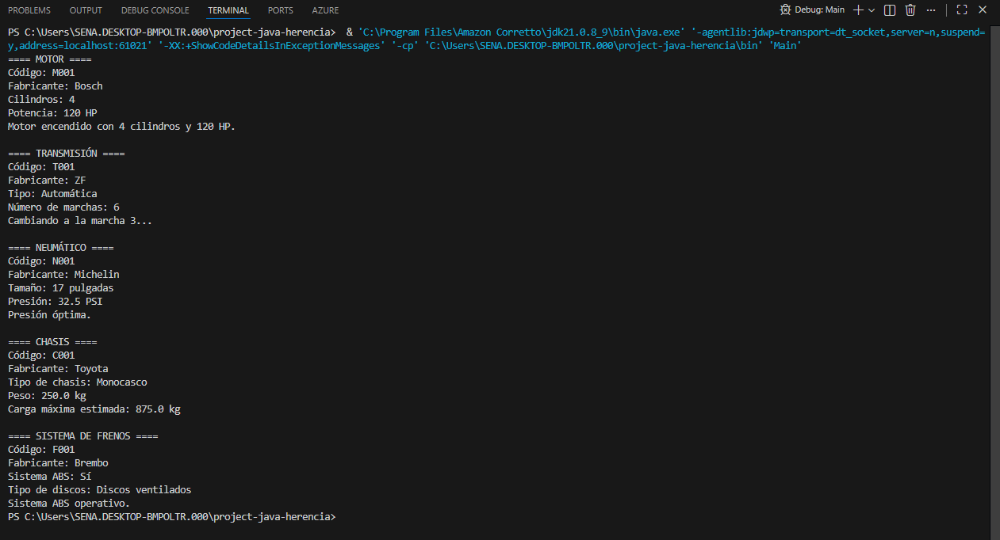

# Project java herencia

## Jerarquia

### Explicacion

                ComponenteVehicular
            --------------------------
            - codigo
            - fabricante
            + mostrarInformacion()
                     ▲
                     │
    ┌───────────────┬───────────────┬───────────────┬───────────────┬───────────────┐
    │               │               │               │               │               │
  Chasis       SistemaFrenos      Neumatico        Motor        Transmision

El sistema está organizado mediante herencia.  
La clase `ComponenteVehicular` funciona como clase base y define los atributos
y métodos comunes a todos los componentes del vehículo.

Las clases `Chasis`, `SistemaFrenos`, `Neumatico`, `Motor` y `Transmision`
heredan de `ComponenteVehicular`, reutilizando su código y ampliando
su funcionalidad según el tipo de componente.

### Clase padre

Esta clase es la base de la jerarquía.
Define los atributos y comportamientos comunes que compartirán todas las subclases.
No describe un componente específico, sino uno general.

### Subclases

### Clase main (ejecutable)

Al ejecutar el archivo `Main` nos aparecera lo siguiente:

